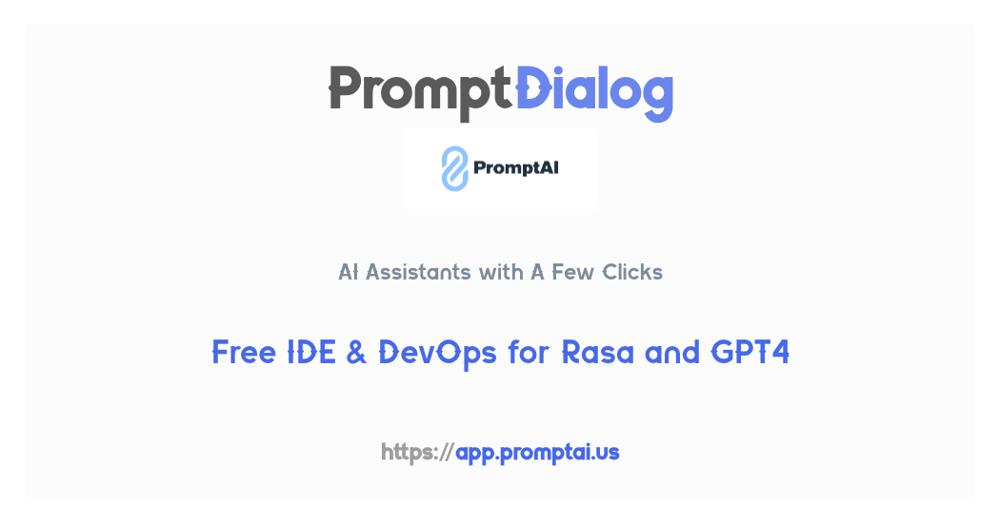

<a target="_blank" rel="noopener noreferrer" href="https://www.promptai.us">
  
</a>
<p align="center">
  <a href="./README.md">English</a> |
  <a href="./README_CN.md">简体中文</a>
</p>

#### [Website](https://www.promptai.us) • [Docs](https://doc.promptai.us) • [FAQ](https://doc.promptai.us/docs/common_questions/) • [Email](mailto:info@promptai.us)
We present PromptDialog, an integrated development (IDE) and operation environment (DevOps) to enable rapid development and delivery of AI assistants, aka, chatbots. 

PromptDialog supports Rasa, ChatGPT and GPT4, together with a design/testing/deployment environment (an alternative of Rasa-X and Rasa-Pro).  With PromptDialog, we aim to bring you an AI experience with the latest LLMs technology and significant reduction (90%) of development cost.
When you are using Rasa Open Source, you might be disappointed by the lack of Large Language Models’ support (LLMs) and the missing of Rasa-X that provides low code user interface for data annotation and model training.  When you are using ChatGPT/GPT4, you might be concerned on how to embed your own business logic in GPT4.  This is exactly what we experienced when building AI assistants for financial institutes and car manufacturers.  PromptDialog solves both problems by enabling GPT4 in RASA Open Source.  And the most important, it is free!  Here are a few highlights:

* Automatically turn enterprise documents of various forms (FAQ, CSV, PDF, Doc, Text, HTML) into one knowledge base that your assistant can rely on, powered by GPT ([talk2bits.com](https://talk2bits.com)). 
* Intuitive business logic design. The dialog flows can be drawn explicitly, not as vague as annotated conversations or python programs any more.  It can be displayed and shared with your team members.
* All-in-one DevOps: Design, develop and operate conversations, on premises or cloud, in one platform.
* Zero shot intent classification and entity recognition, less or even no annotation required (coming soon).

## Use cases
- [IT Helpdesk Starter Pack](https://www.promptai.us/en/examples/#IT)
- [Retail Starter Pack](https://www.promptai.us/en/examples/#Retail)
- [Financial Services](https://www.promptai.us/en/examples/#Financial)

## Use Cloud Services
Visit [www.promptai.us](https://www.promptai.us)

## Localized Deployment

### System Requirements
Before installing PromptDialog, make sure your machine meets the following minimum system requirements:
-  OS: Linux / MacOS
-  location: $HOME/zbot
-  RAM: At least 8GB
-  Docker Env: 20.10.6 or newer
-  Disk Space : At least 32GB available
Optional: 
-  GPU: CUDA 11.7 or newer and GPU Containers Runtime 1.11.0 or newer

### Quick Start
Run following cmd in your terminal.
```bash
curl -o install.sh 'https://cdn.githubraw.com/PromptAI/homepage/main/scripts/install_en.sh' && chmod +x install.sh && ./install.sh
```
After running, you can access the PromptDialog app in your browser at [http://localhost:9000](http://localhost:9000).

## Q&A
See [there](https://doc.promptai.us/docs/common_questions/).

## Contact Us
If you have any questions, suggestions, or partnership inquiries, feel free to contact us through the following channels:
- Submit an Issue or PR on our GitHub Repo
- Send an email to info@promptai.us
- Send a message to [there](https://www.promptai.us/en/contact/)

## Security
To protect your privacy, please avoid posting security issues on GitHub. Instead, send your questions to info@promptai.us and we will provide you with a more detailed answer.
