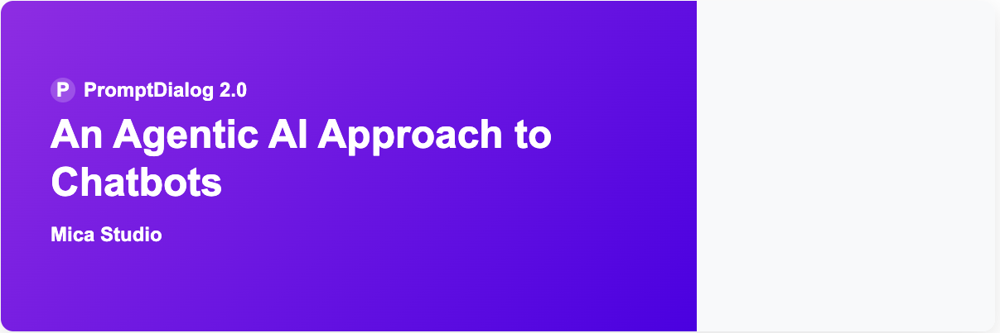

<p align="center">
  <a href="./README.md">English</a>
</p>

#### [官网](https://www.promptai.cn) • [文档](https://doc.promptai.cn) • [常见问题](https://doc.promptai.cn/docs/common_questions/) • [邮箱](mailto:info@promptai.cn)
PromptDialog 是PromptAI.cn 的一款构建智能会话助理的集成开发(IDE)和运维环境(DevOps)，可实现智能助理（又名对话机器人）的快速开发和交付。

PromptDialog支持Rasa和GPT4，以及完整的设计/测试/部署环境（Rasa-X和Rasa-Pro的免费替代方案）。 通过PromptDialog，我们的目标是为您带来最新的LLMs体验，并显着降低 (90%) 的对话系统的开发成本。

当您使用开源的Rasa，您可能会对缺乏大型语言模型(LLMs)支持以及缺少免费的为数据标注和模型训练所必须的低代码用户界面 Rasa-X 感到失望。当您使用GPT4时，您可能会关心如何在GPT4中嵌入自己的业务逻辑。 这正是我们在为金融机构和汽车制造商构建对话机器人所经历的。PromptDialog通过在Rasa Open Source中启用GPT4解决了这两个问题。最重要的是，它是免费的！以下是PromptDialog的一些亮点：
* 自动将各种形式的企业文档（FAQ、CSV、PDF、Doc、Text、HTML）转变为一个由 GPT 提供支持的知识库（[talk2bits.com](https://talk2bits.com)）。 
* 直观的业务逻辑设计流程，可以明确地绘制，不再像带注释的对话或Python程序那样模糊，它可以让您的开发团队成员共享对话流程设计。
* 一体化DevOps：在同一个平台上， 不管是本地或者云端 进行设计、开发和运维客户对话。
* 低样本意图分类和实体识别，需要更少甚至不需要标注数据（即将推出）。

## 例子
- [IT Helpdesk Starter Pack](https://www.promptai.cn/en/examples/#IT)
- [Retail Starter Pack](https://www.promptai.cn/en/examples/#Retail)
- [Financial Services](https://www.promptai.cn/en/examples/#Financial)

## 使用云服务
请访问 [app.promptai.cn](https://app.promptai.cn)

## 本地运行

### 系统环境
在安装PromptDialog之前，需要本地主机有以下环境：
-  系统: Linux / MacOS
-  目录: $HOME/zbot
-  内存: 至少8GB
-  Docker环境: 20.10.6 或者更高
-  磁盘: 至少32GB可用空间
可选项: 
-  GPU: CUDA 11.7 或者更高版本，GPU 运行时容器 1.11.0 或者更高

### 快速开始
执行以下命令在你的终端中：
```bash
curl -o install.sh 'https://cdn.githubraw.com/PromptAI/homepage/main/scripts/install_en.sh' && chmod +x install.sh && ./install.sh
```
等待一段时间运行成功后，访问[http://localhost:9000](http://localhost:9000).

## Q&A
请看[这里](https://doc.promptai.cn/docs/common_questions/).

## 联系我们
如果您有任何疑问、建议或合作咨询，请随时通过以下渠道与我们联系:
- 在我们仓库创建一个 Issue 或者 PR。
- 邮箱联系我们 info@promptai.cn
- 发送消息联系我们 [在这里](https://www.promptai.cn/zh/contact/)

## 安全
为了保护您的隐私，请避免在 GitHub 上发布安全问题。 相反，请将您的问题发送至 info@promptai.cn，我们将为您提供更详细的答案。
