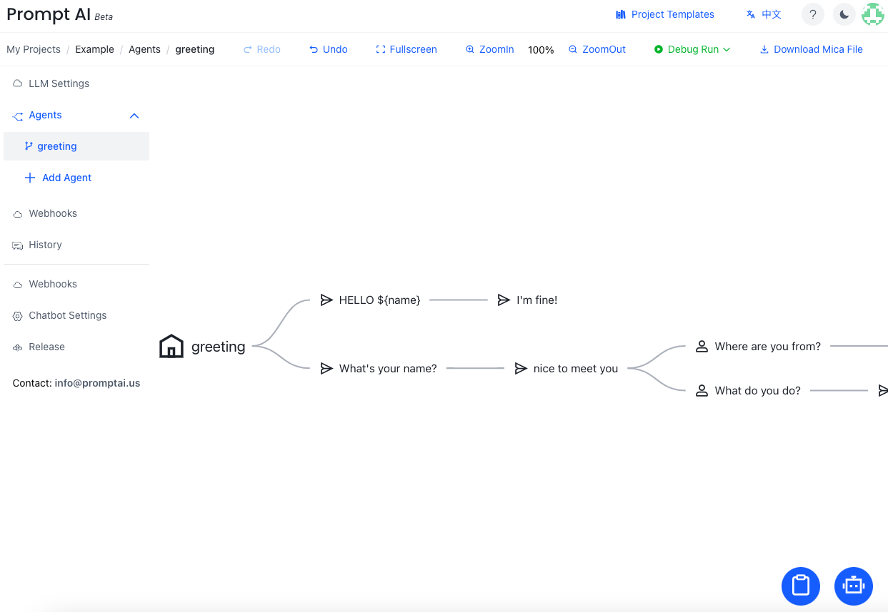

<!--

---
layout: default
title: Dialog Agent Design
nav_order: 3
has_children: false
---

-->
# Dialog Agent Design
{: .no_toc .header }

PromptDialog provides two ways to design dialog agents: 

- LLM Agent: GPT prompt 
- Flow Agent: a step-by-step dialog flow editing tool. 

Users can simply write a GPT prompt to enable a dialog flow.  A designer can also create/edit/upload a dialog flow step-by-step that has a fine control of business logic. 

The editing environment offers a low-code user interface, enabling you to quickly design and configure multi-turn conversations. You can utilize a range of tools and features to define conversation flows, set response logic, etc. 

<!-- Upon the completion of editing, PromptDialog allows you to deploy the model to run in your own environment. This provides you with greater flexibility and control, enabling customization and integration of the chatbot with your existing systems. You can run the model in a local environment, achieving faster response times and maintaining data privacy. -->

Please refer to the detailed tutorials for LLM agent and Flow agent design.
- [LLM Agent](/docs/tutorial/llm_agent/)
- [Flow Agent](/docs/tutorial/flow_agent/)
