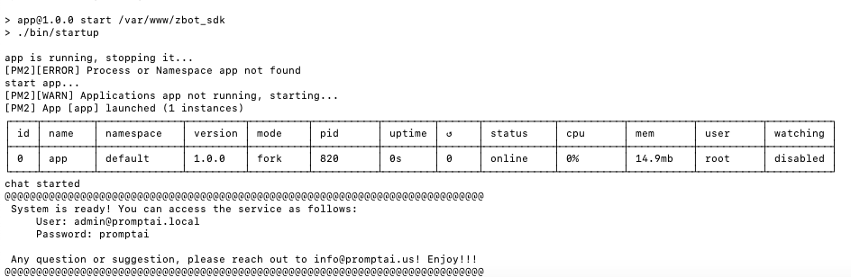
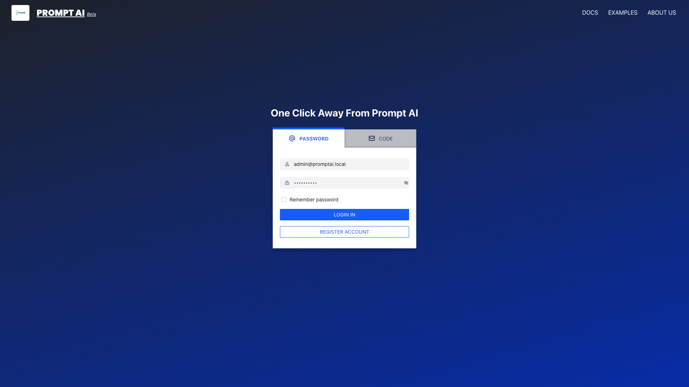
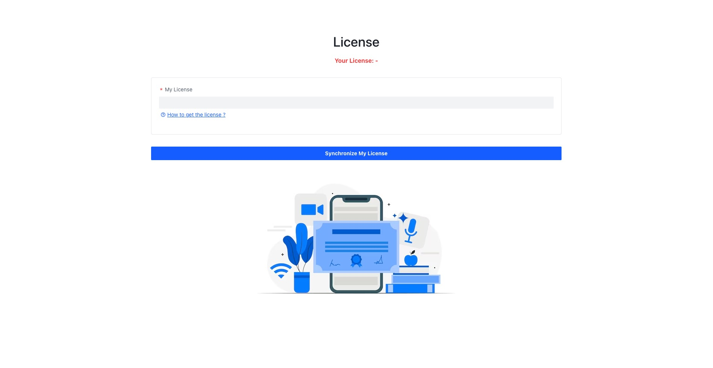
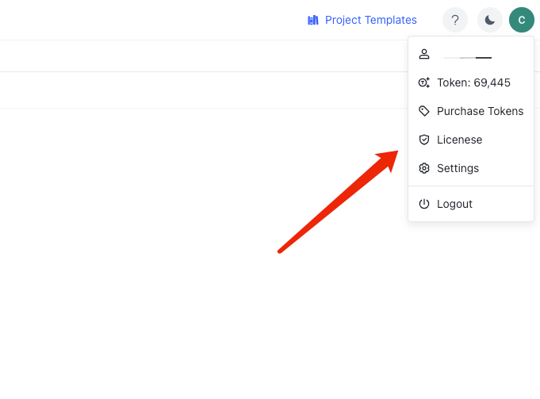
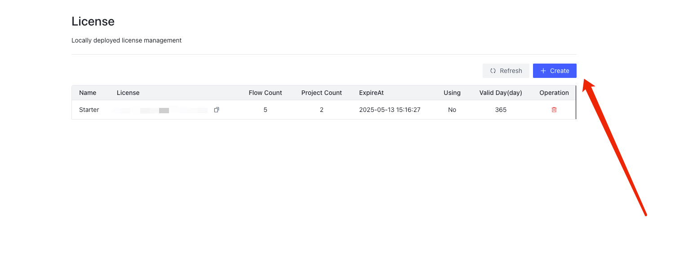
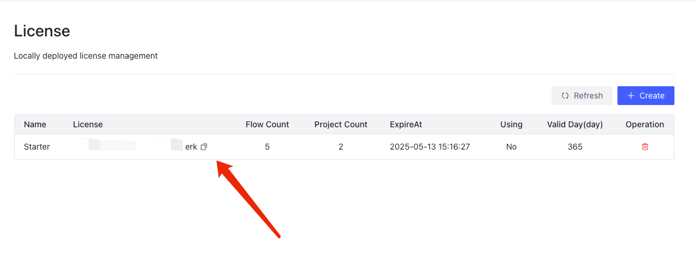

# Local Deployment

If you need to deploy the service to your own server or local, you can refer to the following tutorial.

Install PromptDialog in a local machine.  PromptDialog will only create and operate in the following directory of your machine.
- location: $HOME/zbot

The installation is done using Docker, including the following images.

- Docker Images

|  Image |         Description         | 
|:------|:-----------------------------|
| promptai/zbot-aio:release  | PromptDialog  service framework     |


## Requirements
```text
OS           :Linux/Mac OS
Architecture :amd64
RAM          :At least 8GB
Docker Env   :20.10.6 or newer
Disk Space   :At least 32GB available
```

## Installation Command
Run the following command in your terminal.
```shell
curl -o install.sh 'https://raw.githubusercontent.com/PromptAI/homepage/main/scripts/install_en.sh' && chmod +x install.sh && ./install.sh
```
*The size of Prompt AI's docker images is around 12 GB. The installation time varies depending on your network speed. Typically, the initial installation takes between 10 to 30 minutes.*

When the system is ready, you will see the system information. Please change the admin password immediately. 



### Login
Login: [http://localhost:9000](http://localhost:9000)


## How to get a Free License?
Following installation, a license is needed. We offer a complimentary license for the local installment.


1、The first step is to register your PromptAI account:

Register a PromptAI account:[https://app.promptai.us/](https://app.promptai.us/)

2、After logining to PromptAI, click your avatar and then click "License"：



3、Click the "Create" button you will get a free "Starter" license


4、Add your license



## How to get a Professional License?

Professional licenses are coming soon, please contact us if you need one.
Mail to: [info@promptai.us](mailto:info@promptai.us)


