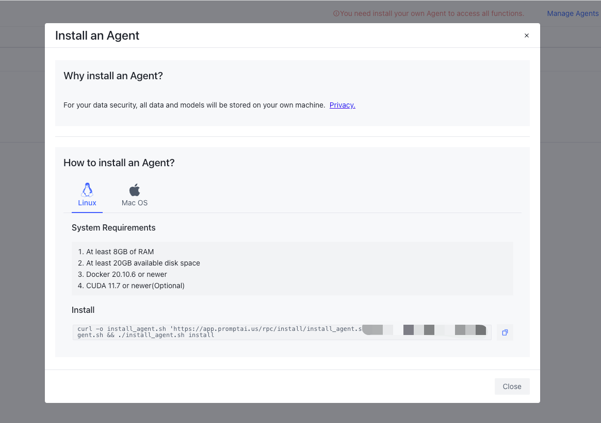

# Local Running Environment
{: .no_toc .header }

Initialize the local operating environment. After successfully creating an account, you can start designing your chatbot immediately. If you need to run chatbot, you need to initialize the local operating environment.


## What is Agent？
In PromptAI, Agent builds a "communication bridge" between the cloud and the user environment, assisting the cloud in managing models, data, and conversations.

### 工作内容

- 接受训练任务
- 上传任务执行步骤、结果
- 上传训练好的模型，便于负载均衡时不用重复训练模型
- 接受和响应对话请求
- 创建、停止和升级AI容器

### 目录
不同的操作系统使用目录不同，Agent对该目录下文件和目录有读写权限。

- 数据与系统运行有关，请勿操作。否则可能导致系统无法正常工作。
- 数据、目录结构可能会变化，同时里面的数据可能会被服务端使用。

| 系统  | 目录              |
|-------|------------------|
| Linux | /usr/local/zbot  |
| MacOS | /$HOME/zbot       |

```shell
.
└── .promptai
    ├── .agent
    │   ├── a1 ## 训练任务，目录名称为内部账户名称
    │   ├── download ## 训练数据目录
    │   ├── pqdata ## 缓存数据
    │   │   ├── reporter.published.project ## 发布项目的缓存
    │   │   ├── reporter.task.result ## 任务执行结果缓存
    │   │   └── reporter.task.step ## 任务执行步骤缓存
    │   └── published_project.conf ## 发布的项目数据
    └── .ai  ## AI 数据目录
        ├── log ## 日志目录
        │   └── a1 ## 目录名称为内部账户名称
        │       ├── debug ## 调试的日志
        │       ├── p_cm6gp9vx6igw ## 发布项目的日志 名称为项目ID，可能会有多个
        │       ├── p_cm6j0rozjncw
        │       └── p_cmaamgq4bsao
        ├── model ## 模型文件目录
        │   └── a1 ## 目录名称为内部账户名称
        │       ├── debug ## 调试的模型
        │       ├── p_cm6gp9vx6igw ## 发布项目的模型 名称为项目ID，可能会有多个
        │       ├── p_cm6j0rozjncw
        │       └── p_cmaamgq4bsao
        └── train ## 训练数据目录
            └── a1 ## 目录名称为内部账户名称
                ├── debug ## 调试的训练数据
                ├── p_cm6gp9vx6igw ## 发布项目的训练数据 名称为项目ID，可能会有多个
                ├── p_cm6j0rozjncw
                └── p_cmaamgq4bsao
```

### 文件
1、Agent控制脚本
安装agent成功后，会在`/usr/local/bin`目录创建`install_agent.sh`脚本，用于升级、卸载Agent。
```shell
/usr/local/bin/install_agent.sh
```

2、Docker 

Agent 运行依赖Docker环境，包括两个Image和多个Containers
- Docker Images

| 名称   | Image                        | 说明                            |
|:------|:-----------------------------|---------------------------------|
|  AI   | promptai/zbotai:release      | AI模型                          |
| Agent | promptai/zbot-agent:latest   | Agent服务，管理AI容器             |

- Docker Containers

| 名称   | Container    | 说明                                                        |
|:------|:-------------|-------------------------------------------------------------|
|  AI   | zbot_a1_xxx  | "xxx"为调试的模型或具体的项目，可能有多个，与发布的项目数量有关       |
| Agent | zbot_agent   | Agent服务，管理AI模型 ，有且仅有一个                             |

-Diagram


## Create first Agent
After logging in to the system, you will see a prompt above the system before creating the first Agent: "You need install your own Agent to access all functions."
After clicking, you will see the following content.


- Why install an Agent?
- How to install an Agent?

Before installation, you need to check whether your environment meets the installation requirements:
### System Requirements
```text
OS         :Linux/Mac OS
RAM        :At least 8GB
GPU        :CUDA 11.7 or newer(Optional)
Disk       :Space: At least 20GB available
Docker Env :20.10.6 or newer
```
When everything is ready, you can execute different installation commands according to the corresponding operating system type:
```shell
curl -o install_agent.sh 'https://app.promptai.us/rpc/install/install_agent.sh?key=your_config' && chmod +x install_agent.sh && ./install_agent.sh install
```
`The installation is often related to your network environment and equipment, please be patient. If you need help, please contact us`

After the installation is successful, enter the "Manage Agents" page to see the installed Agent


Enjoy