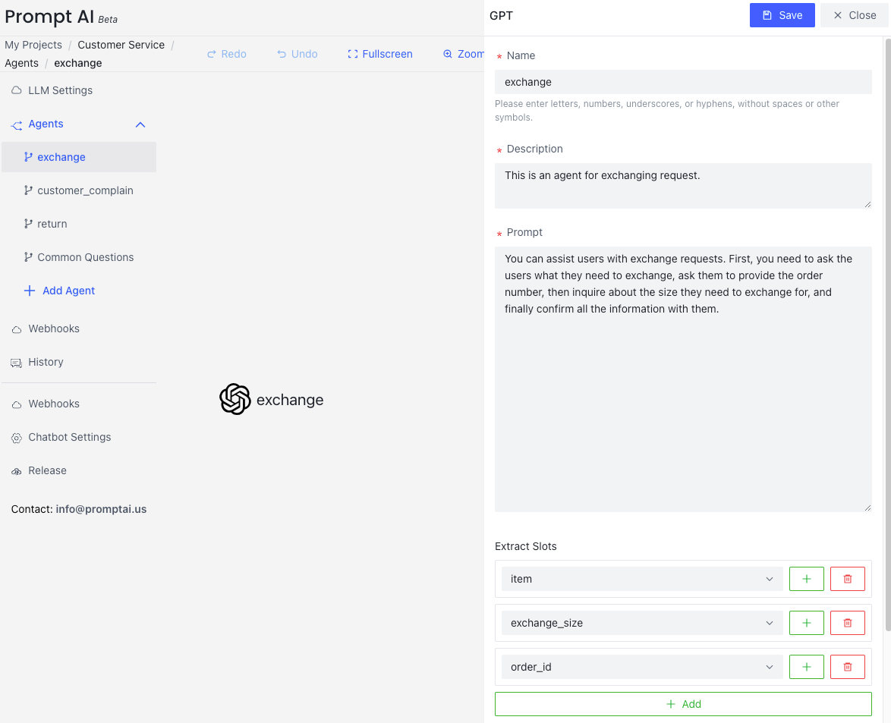

# Customer Service
{: .no_toc .header }

我们将通过一个服装零售场景的客服服务示例，帮助你快速了解 PromptDialog 的能力。该客服服务由三个基于大语言模型（LLM）的智能助手（Agents）组成，分别处理用户的投诉、换货和退货请求，确保为用户提供全面的售后服务支持。

- Customer Complain: 能够记录用户的投诉，首先向用户道歉，了解用户对产品的不满并记录详细信息，确保改进措施得到实施。
- Exchange         : 帮助用户处理商品换货请求，包括询问商品的订单号和需要换的尺寸，确保换货信息准确并进行处理。
- Return           : 协助用户处理退货请求，包括验证订单是否符合退货条件、询问退货原因以及确认用户的退款方式，确保退货流程顺利进行。

通过以上三个智能助手的协同工作，PromptDialog 能够为服装零售企业提供全面的售后服务能力，覆盖用户从投诉到换货、退货的全流程需求，确保服务高效、用户满意。

## Create LLM Agents

### Customer Complain:
This chatbot is designed to handle user complaints by collecting two key pieces of information: the reason for dissatisfaction and the specific product involved. It apologizes to users, records these details, and assures them that improvements will be made based on their feedback.

### Exchange
This chatbot assists users with exchange requests by collecting three key pieces of information: the order number, the product to be exchanged, and the desired new size. It confirms all details with the user to ensure a smooth exchange process.

### Return
This chatbot assists users with return requests by collecting four key pieces of information: the product to be returned, the order number (verified using the 'check_order_available' function), the reason for the return, and the preferred refund method (credit or original payment). It ensures a seamless and user-friendly return process.

## Run

Realization effect:

- 处理用户换货请求，包括询问商品的订单号和需要换的尺寸，确保换货信息准确并进行处理。
- 处理用户投诉，能够记录用户的投诉，首先向用户道歉，了解用户对产品的不满并记录详细信息，确保改进措施得到实施。
- 处理用户退货请求，包括验证订单是否符合退货条件、询问退货原因以及确认用户的退款方式，确保退货流程顺利进行。

<table>
  <tr>
    <td></td>
    <td></td>
  </tr>
  <tr>
     <td></td>
  </tr>
</table>
