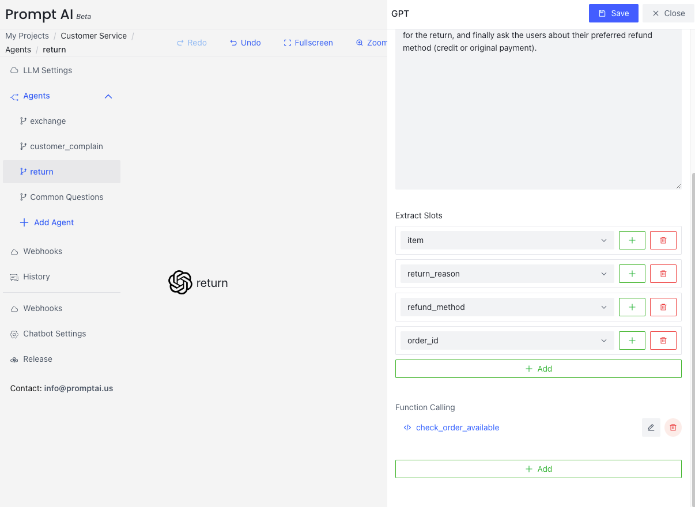

# Customer Service
{: .no_toc .header }

We will use an example of a customer service system in a clothing retail scenario to help you quickly understand the capabilities of PromptDialog. This customer service is composed of three LLM Agents based on large language models (LLMs), each handling user complaints, exchanges, and returns, ensuring comprehensive after-sales service support for users.

- Customer Complain: Records user complaints, apologizes to the user, understands their dissatisfaction with the product, and documents detailed information to ensure corrective measures are implemented.

- Exchange: Assists users with product exchange requests, including asking for the order number and the desired size for the exchange, ensuring accurate exchange information and processing.

- Return: Helps users with return requests, including verifying if the order meets return conditions, inquiring about the reason for the return, and confirming the user’s refund method, ensuring a smooth return process.

Through the collaboration of these three intelligent assistants, PromptDialog provides clothing retail businesses with comprehensive after-sales service capabilities, covering the entire process from complaints to exchanges and returns, ensuring efficient service and customer satisfaction.

## Create LLM Agents

### Customer Complain:
This agent is designed to handle user complaints by collecting two key pieces of information: the reason for dissatisfaction and the specific product involved. It apologizes to users, records these details, and assures them that improvements will be made based on their feedback.

### Exchange
This agent assists users with exchange requests by collecting three key pieces of information: the order number, the product to be exchanged, and the desired new size. It confirms all details with the user to ensure a smooth exchange process.

### Return
This agent assists users with return requests by collecting four key pieces of information: the product to be returned, the order number (verified using the 'check_order_available' function), the reason for the return, and the preferred refund method (credit or original payment). It ensures a seamless and user-friendly return process.

## Run

Realization effect:

- Handle user exchange requests, including asking for the order number and the desired size for the exchange, ensuring the accuracy of the exchange information, and processing the request.
- Handle user complaints by recording their concerns, apologizing to the user initially, understanding their dissatisfaction with the product, and documenting detailed information to ensure improvement measures are implemented.
- Handle user return requests, including verifying whether the order meets the return conditions, asking for the reason for the return, and confirming the user's refund method to ensure a smooth return process.

[//]: # (<table>)

[//]: # (  <tr>)

[//]: # (    <td></td>)

[//]: # (    <td></td>)

[//]: # (  </tr>)

[//]: # (  <tr>)

[//]: # (     <td></td>)

[//]: # (  </tr>)

[//]: # (</table>)
