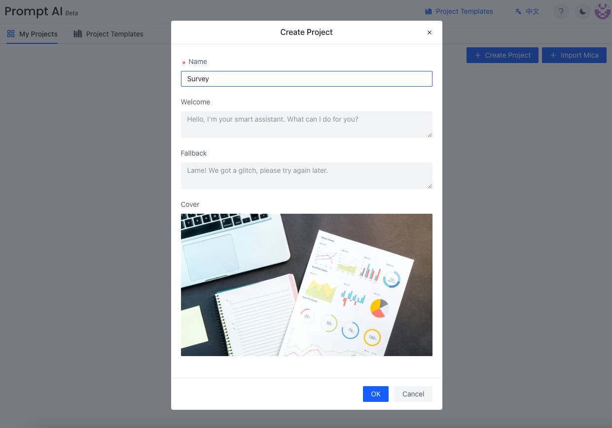
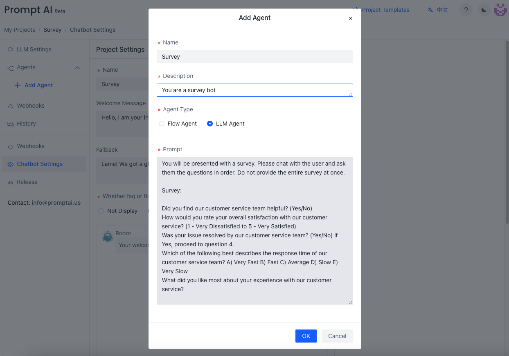
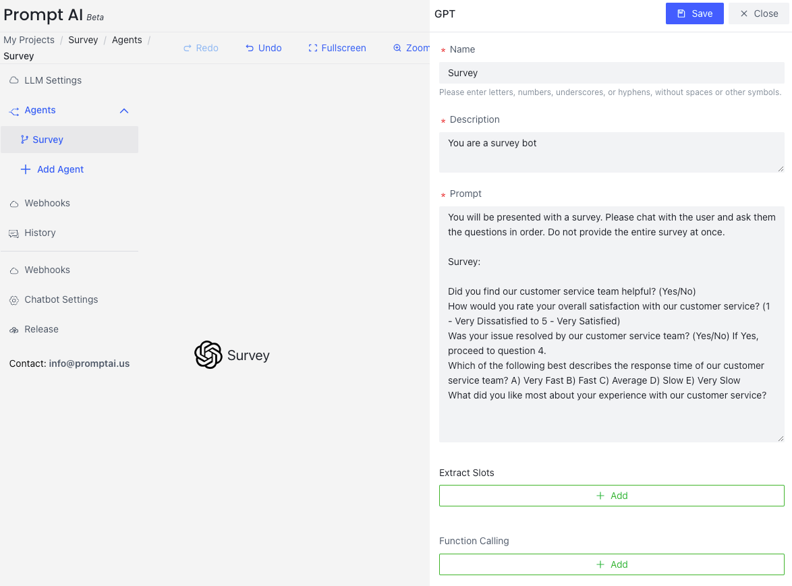
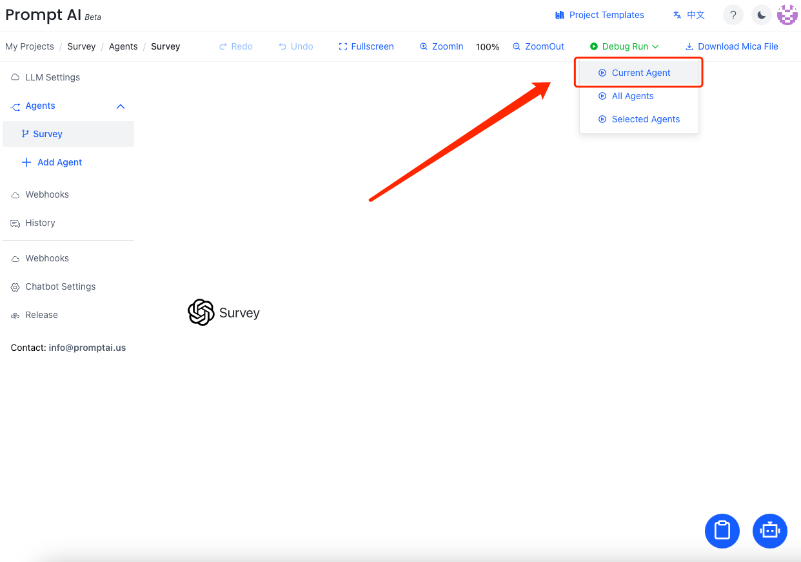
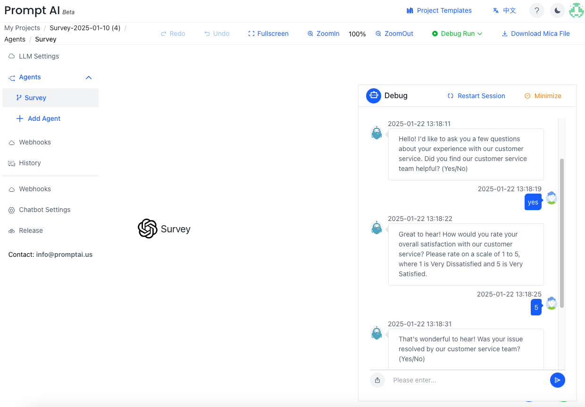
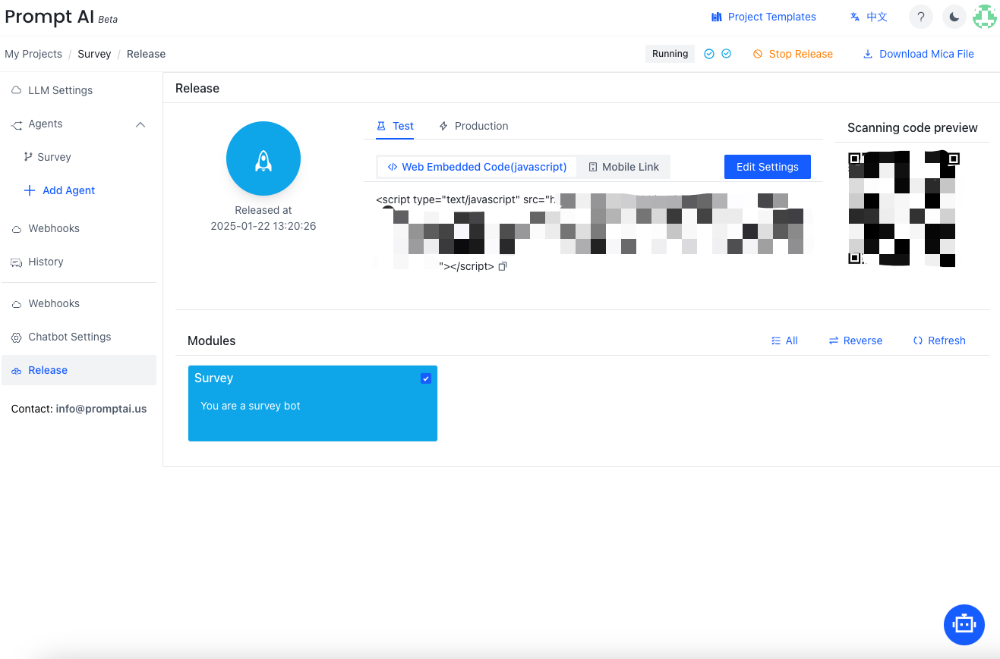
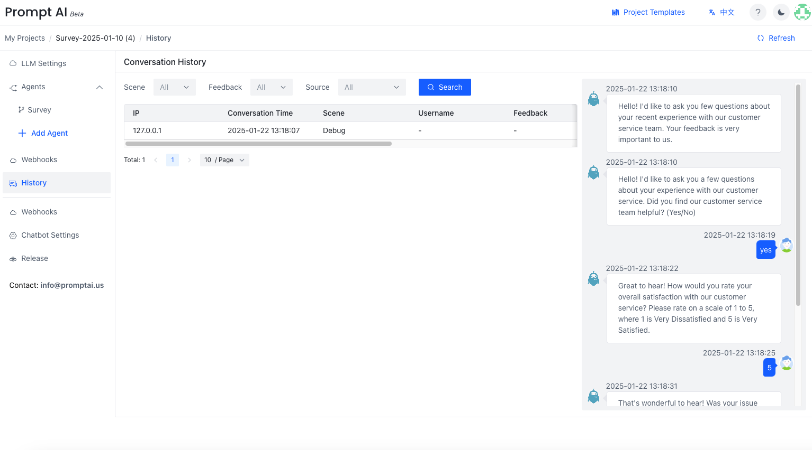

# Survey
<!-- PromptAI提供专业的对话机器人设计体验，旨在简化构建过程，使其简单高效。我们提供直观的流图设计工具，让您轻松创建对话机器人。PromptAI包含丰富的预制功能，包括文档、网页链接、文件转换成对话内容等。我们支持简单的问答交互，简单信息的收集，以及复杂多信息的收集。您可以控制丰富的富文本回复内容，并支持Webhook调用、对话历史记录、以及发布为Web内嵌对话机器人和移动端对话机器人。此外，我们还提供预制变量设置，以帮助您快速高效地设计和部署您的对话机器人。 -->

<!-- PromptAI provides an intuitive conversation design tool for fast bot creation. It enable webhook calls, conversation history, as well as publishing as a web-embedded chatbot and a mobile chatbot. You have full control over response content. -->
<!-- ## 快速开始  -->
<!-- 以下是在云版本中创建第一个对话机器人的例子。（更多例子在[这里](/docs/examples/)可以查看） -->
Let's build the first PromptAI chatbot. 
<!-- Here is an example of creating the first chatbot in the cloud version. (Local version examples or more examples can be found [here](/docs/example/)) -->

1. Create the project.

2. Create the LLM Agent. 

  

    
copy/past the survey prompt

    <pre><code> please add the survey prompt here
    </code></pre>
  

3. Click `Save` to save the LLM Agent.

4. Click the "Debug Run" button on the upper right corner to start testing.

5. Wait and test your survey bot.

<!-- ## 快速发布 -->
## Publish
<!-- 选择我们刚刚测试运行好的流图，进行发布。发布之后，我们可以看见web内嵌链接，和移动端链接。更多发布相关内容请看这里。 -->
Select the bot that you just tested, then proceed with publishing. After publishing, you can see the web-embedded link and the mobile link. For more information on publishing, please refer to [this section](/docs/tutorial/release/release_project).

<!-- ## 对话历史和Dashboard -->
## Conversation History
<!-- 对话历史纪录了，当前项目的所有对话信息。 -->
You can review the conversation history records for the current project.

