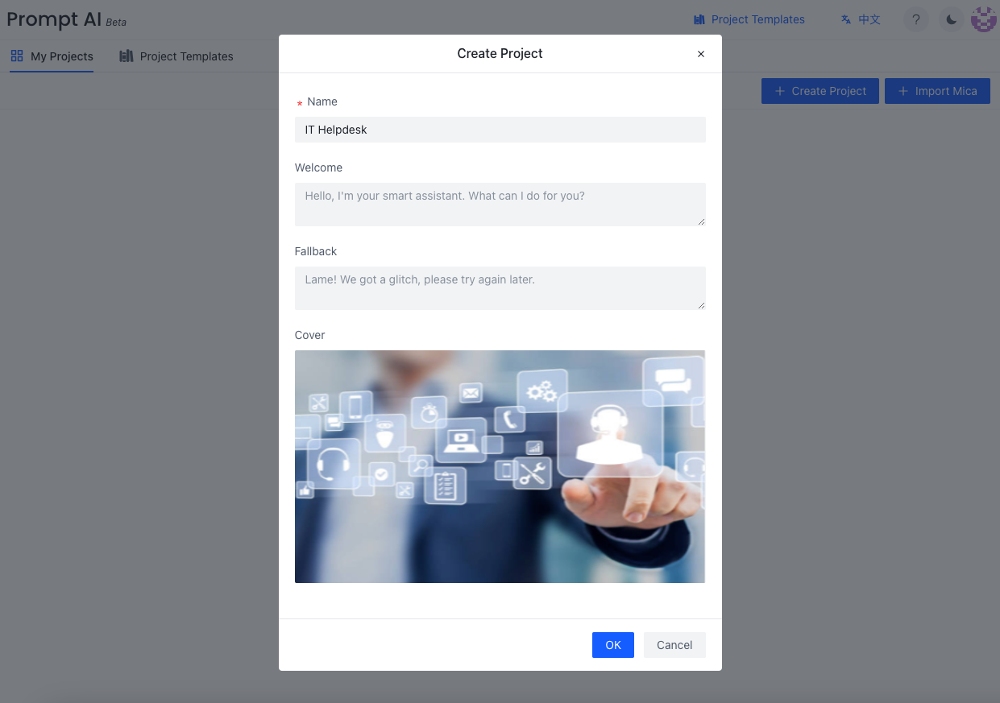
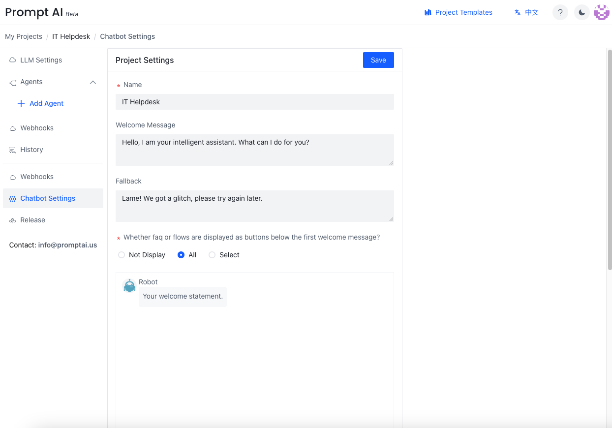

After logging in, click the `Create Project` button in the upper right corner to fill in the project related information in a pop-up dialog box.

The Chatbot Settings allow you to modify the chatbot profiles.

