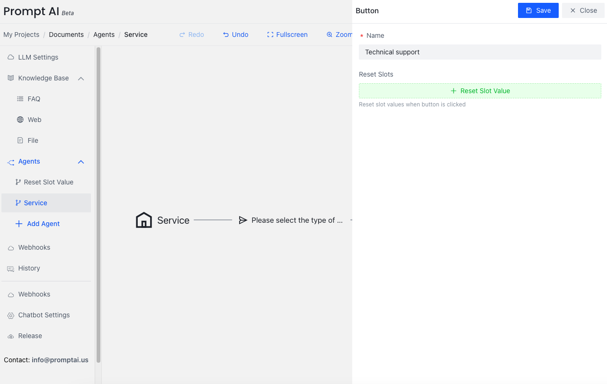

# Button
{: .no_toc .header }

Button nodes can be added after bot nodes. Buttons provide users with clickable options to control the flow direction to specified processes. Multiple buttons can be added after a bot node, and a group of buttons can only be clicked once.

Button nodes provide users with predefined options, allowing them to respond quickly by clicking buttons without manually entering text. This interaction method can improve user experience and ensure input accuracy.

## Button Features

| Feature               | Description                                                                  |
|-----------------------|------------------------------------------------------------------------------|
| Flow Control          | Button clicks can guide the conversation flow to specified nodes or branches|
| One-time Use          | A group of buttons can only be clicked once, and the button group disappears after clicking|
| Multi-button Support  | Multiple buttons can be added after one bot node to provide users with multiple choices|
| Predefined Options    | Button text is predefined to ensure consistency of user input               |
| Quick Response        | Users don't need to manually input, they can make quick choices by clicking |

## Usage Scenarios

### Service Type Selection
Suppose we have a customer service bot that needs users to select a service type:

The bot asks: "Please select the type of service you need:"

Then provides three buttons for users to choose from:
- Technical Support
- Billing Inquiry
- Product Consultation

After the user clicks one of the buttons, the conversation flow will jump to the corresponding processing branch based on the selection.

## Configuring Button Nodes

### Adding Buttons
Click the bot node to add a Button

Set button text

### Multi-button Configuration
When you need to add multiple buttons:
1. Repeatedly add button nodes
2. Set different text and targets for each button
3. Ensure button text is concise and clear

## Best Practices

### Button Text Design
- Use concise and clear text
- Avoid overly long button labels
- Ensure clear distinctions between options

### Button Quantity Control
- Recommend no more than 5 buttons in one group
- Too many options will affect user experience
- Use hierarchical organization for complex options

### Flow Design
- Ensure each button has a clear target node
- Avoid infinite loops or invalid jumps
- Provide users with mechanisms to return or reselect

## Important Notes

1. **One-time Use**: Button groups disappear after user clicks and cannot be reused
2. **Flow Control**: Properly design button jump logic to ensure conversation flow continuity
3. **User Experience**: Buttons should provide clear choices and avoid confusing users
4. **Compatibility**: Ensure buttons display and function properly on different devices and platforms

## Tips
Button nodes are important tools for building interactive conversation flows. Proper use of buttons can significantly improve user experience and simplify complex conversation logic.