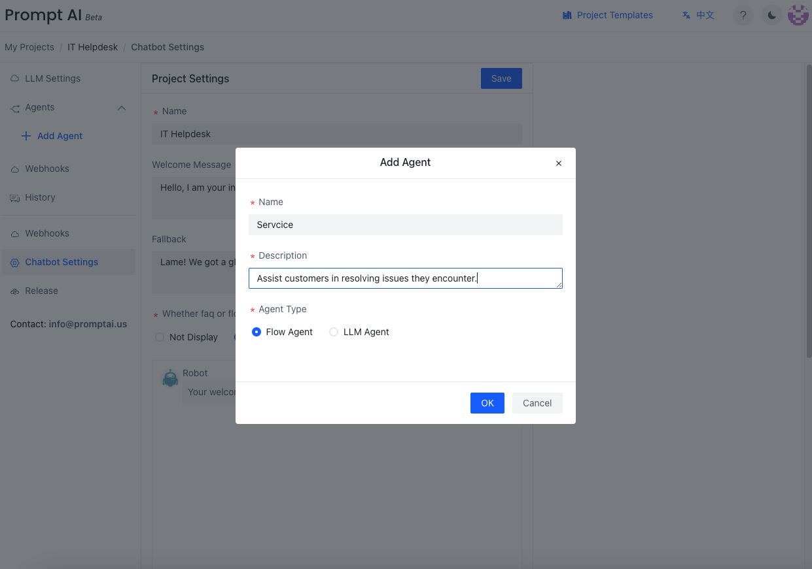
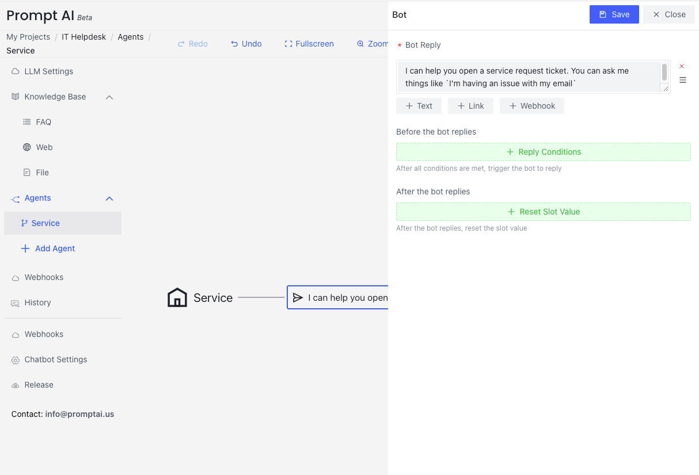
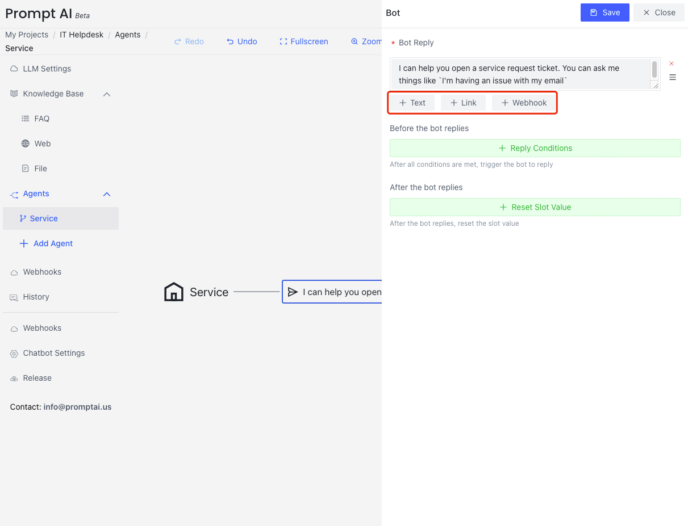
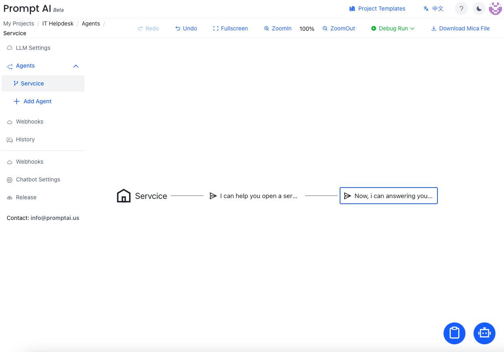
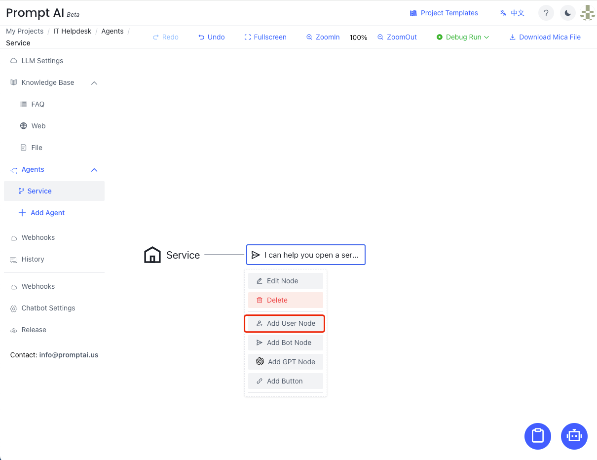
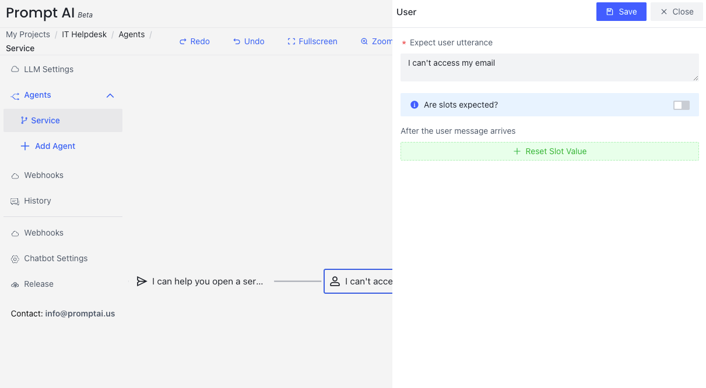
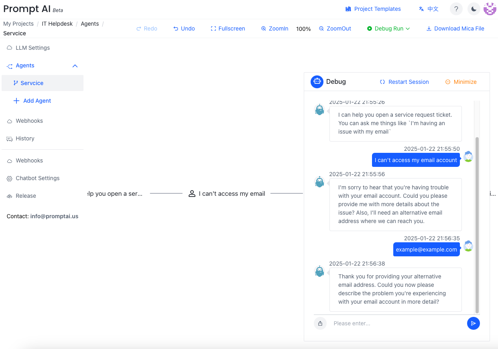

## Create a Flow Agent
Click `Add Agent` in the left navigation pane to add a new Flow Agent.  Enter the agent name and description in the pop-up dialog box.

## A bot node
Click and select `Add Bot Node` or `Edit Node` from the pop-up menu. 

The followings are a few options you can make for bot reply. 

| Name                          | Usage                                                                                                       |
|-------------------------------|-------------------------------------------------------------------------------------------------------------|
| Bot Reply                     | What the bot will say                                                                                       |
| Bot Reply Type                | Two different kinds of replies the bot can make. Please choose one.                                         |
| Before the bot replies        | The [reply condition](/docs/tutorial/flow_agent/reply_conditions/) that needs to be met before the bot replies. |
| After the user message arrives| If needed, [reset slot value](/docs/tutorial/flow_agent/reset_slot/)                                            |

### There are twp different kinds of replies a bot can make:

- Text       : Send a text message to the user
- Link       : Navigate the user to a specified URL when clicked
- Webhook    : Call a webhook 

<mark>Note</mark> that you can use the `${}` curly brace syntax in text replies to utilize Slot values existing in the system.

### Multiple bot responses
We can add multiple lines of texts to the bot response node or add another bot response node after the current one. 

Another bot response node can be added after the current one.

## A user node
After creating a bot, it will display the flow window. Click the node of bot and here we click `Add User Node`.

### Edit a user node
Click the user utterance; the editing pane will pop up on the right. It is expected that multiple utterances are needed so that the user intent can be classified correctly.

The followings are a few options you can make for user utterance. 

| Name                           | Usage            |
|--------------------------------|-------------------|
| Expect User Utterance          | The expected user utterance in this node     |
| Are slots expected?            | Are we going to extract a slot value(s) from the user utterance?   |
| Description                    | Some comments about this intent (optional)|
| After the user message arrives | If needed, [reset slot value](/docs/tutorial/flow_agent/reset_slot/) based on the user utterance   |

## An LLM Agent node
The fastest way to create a conversational bot in a flow agent is providing an LLM prompt script via LLM Agent

    
copy/past the Incident Agent prompt

    <pre><code> 
When users report a problem, you need to collect the details and an email address.</code></pre>
  

[LLM Agent](/docs/tutorial/llm_agent)

## Complete a Flow Agent

## Run the Flow Agent
You can click `Debug Run` to test your Flow Agent.

