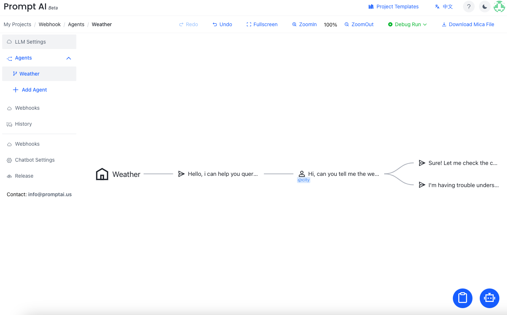
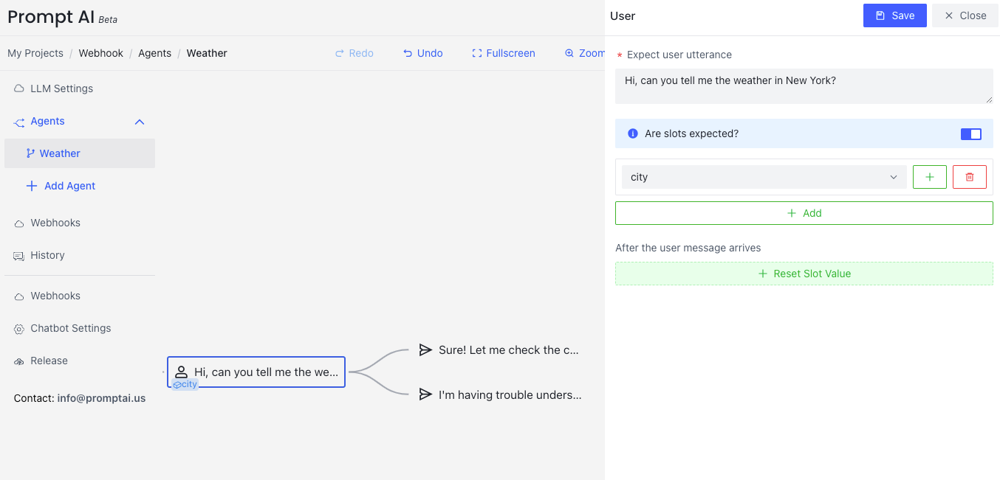
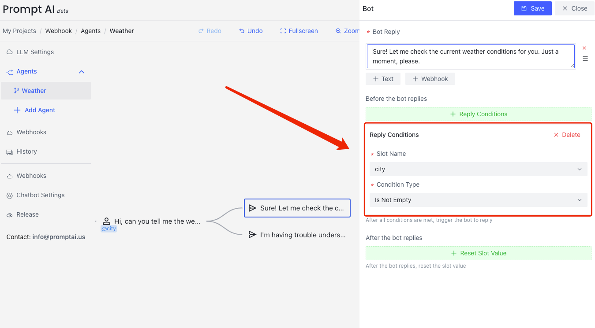
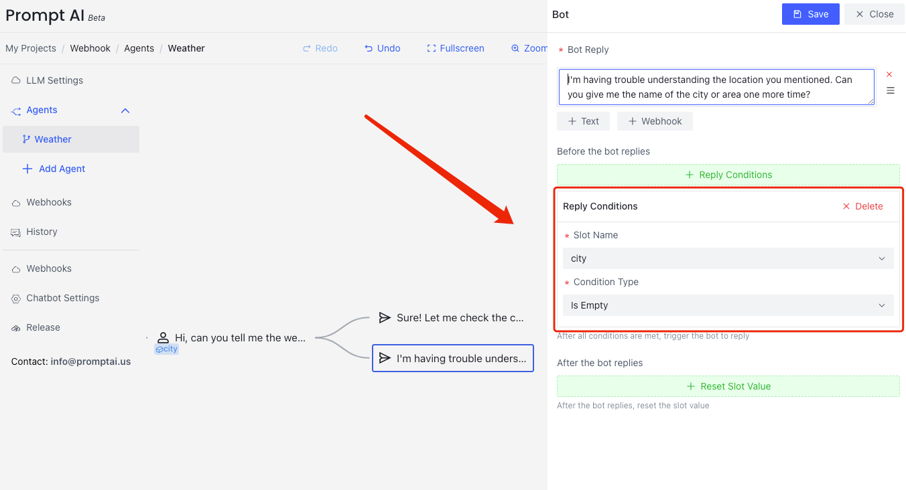

# Reply Conditions
{: .no_toc .header }
Before the bot replies, the content of the reply can be determined by whether the slot has a value or not. You can use this mechanism to implement the  basic logic of if-then-else. 

All the reply conditions are defined in the `Reply Conditions` section.

| Name                  | Slot Type     | Usage                                                                        |
|-----------------------|---------------|------------------------------------------------------------------------------|
| Greater Than          | number        | Checks if the value is greater than the specified number.                    |
| Greater Than or Equal | number        | Checks if the value is greater than or equal to the specified number.        |
| Less Than             | number        | Checks if the value is less than the specified number.                       |
| Less Than or Equal    | number        | Checks if the value is less than or equal to the specified number.           |
| Starts With           | string        | Checks if the string starts with the specified prefix.                       |
| Ends With             | string        | Checks if the string ends with the specified suffix.                         |
| Contains              | string        | Checks if the string contains the specified substring.                       |
| Not Contains          | string        | Checks if the string does not contain the specified substring.               |
| Regex                 | string        | Checks if the string value matches the specified regular expression pattern. |
| Is Empty              | string        | Checks if the string value is either `None` or empty.                        |
| Is Not Empty          | string        | Checks if the string value is neither `None` nor empty.                      |
| Equal                 | string/number | Checks if the value is equal to the specified condition.                     |
| Not Equal             | string/number | Checks if the value is not equal to the specified condition.                 |

## Query weather 
Depending on the user utterance, there are two possible replies:
- Reply with the weather information or
- Ask the user for the location
  

If the user utterance doesn't contain the location information (At this point we can use `Reply Conditions` to detect), the bot needs to ask the user:
- I'm having trouble understanding the location you mentioned. Can you give me the name of the city or area one more time?

In this case, we can extract `city` to determine the location.  

## Set Reply Conditions
- Click `Reply Conditions`
- Select `Slot Name` with `city`
- Select `Is Bot Empty` to `Conditional Type`

This means that the bot will reply when `city` has a value

You can set the condition of asking for the location:
- Click `Reply Conditions`
- Select `Slot Name` with `city`
- Select `Is Empty` to `Conditional Type`

This reply will be delivered when there is no value for `city`.

## Tips
The slot value can be used to guide the dialog flow to different branches. 
