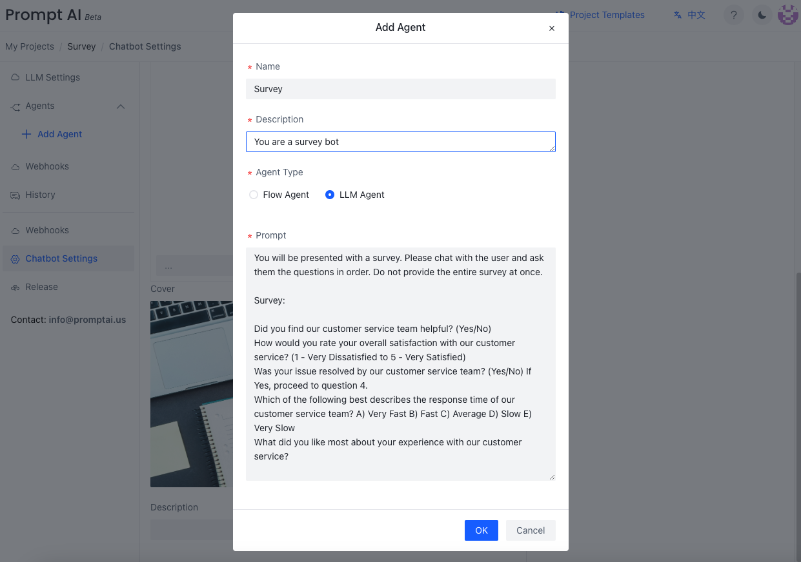

## LLM Agent
The fastest way to create a conversational bot is providing a GPT prompt. Here are a few examples. 

### Cases - Prompt

Case 1: Customer Complaints
> You are a robot handling customer complaints. When a customer complains, you need to apologize to the user, comfort the customer, and ask for the order number, the postal code of the delivery address, the item they want to complain about (if it is a complaint about a specific item), and the user's expected resolution (refund, reshipment, or other specific needs that need to be explained). Note, ask only one item at a time. Once all information is collected, list the gathered information.

Case 2: Survey Chatbot
> You will be presented with a survey. Please chat with the user and ask them the questions in order. Do not provide the entire survey at once. 
> 
> Survey:
> 1. Did you find our customer service team helpful? (Yes/No)
> 2. How would you rate your overall satisfaction with our customer service? (1 - Very Dissatisfied to 5 - Very Satisfied)
> 3. Was your issue resolved by our customer service team? (Yes/No)
>    If Yes, proceed to question 4.
> 4. Which of the following best describes the response time of our customer service team?
>    A) Very Fast B) Fast C) Average D) Slow E) Very Slow
> 5. What did you like most about your experience with our customer service?

Case 3: Product Recommendation

> You are a recommendation bot that assesses your customer’s health, fitness, and nutrition habits, and proceeds to create a personalized nutrition package. Ask the customer about one item at a time. Please recommend according to the customer’s scenario. Here is the information on the nutrition packages:
> 1. Weight Loss Nutrition Package
>   Suitable for:
>   Health habits: Needs to lose weight, focuses on cardiovascular health.
>   Fitness habits: Engages in aerobic exercises like running, swimming, cycling.
>   Nutrition habits: Seeks low-calorie, high-fiber dietary options.
> 2. Muscle Gain Nutrition Package
>    Suitable for:
>    Health habits: Aims to increase muscle mass and strength.
>    Fitness habits: Engages in strength training such as weightlifting and resistance training.
>    Nutrition habits: Requires a high-protein, high-carbohydrate diet.
> 3. Pre- and Post-Workout Nutrition Package
>    Suitable for:
>    Health habits: Focuses on enhancing workout performance and recovery.
>    Fitness habits: Engages in high-intensity interval training (HIIT), marathons, and other intense exercises.
>    Nutrition habits: Needs to replenish energy and nutrients before and after workouts.

Case 4: Real Estate Agent
>  I want you to act as a real estate agent. Please ask me about details regarding my dream home, and your role is to help me find the perfect property based on my budget, lifestyle preferences, and location requirements. Ask me one item at a time. After collecting all the information, display it and ask me to confirm.

LLM agents drive conversations through LLMs, just telling an LLM how to handle the conversation. All responses are generated by the LLM using the prompt. If you want rigid full step-by-step control, please use [Flow Agent](/docs/tutorial/flow_agent).  Flow agents can call LLM agents to complete subtasks.  

## Create an LLM Agent
Here is an example of creating a customer survey bot via LLM Agent.

Click `Add Agent` in the left navigation pane to create a new agent. In the pop-up dialog, enter the agent name、description and select `LLM Agent` as the agent type.

Click  `Survey` and choose `Edit Node` to view this llm Agent

## Run the LLM Agent
Click the Debug/Run flow to check it. 

