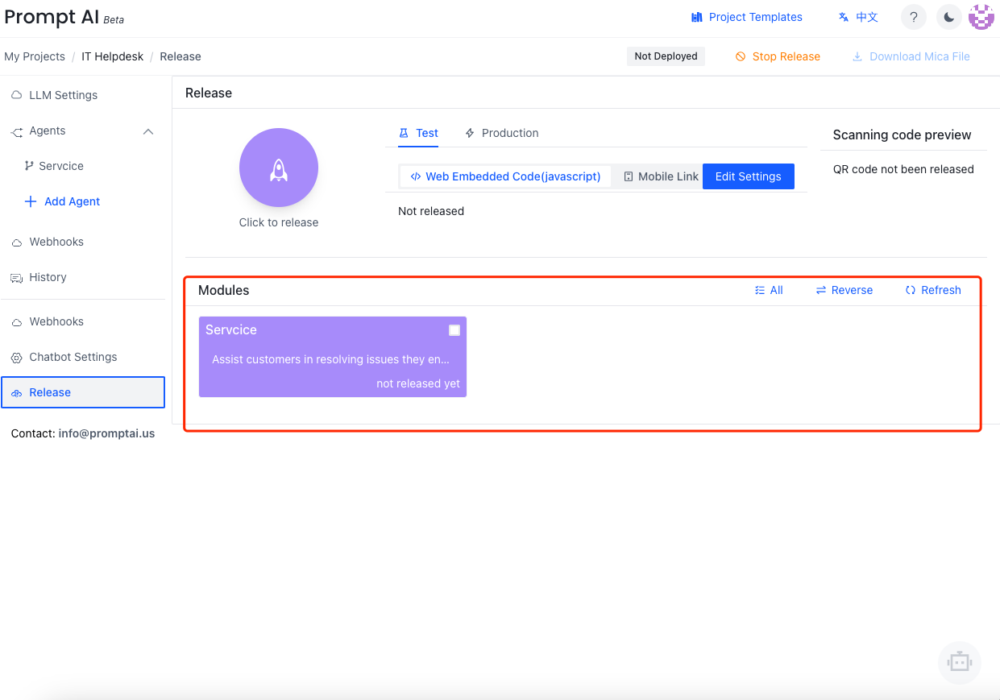
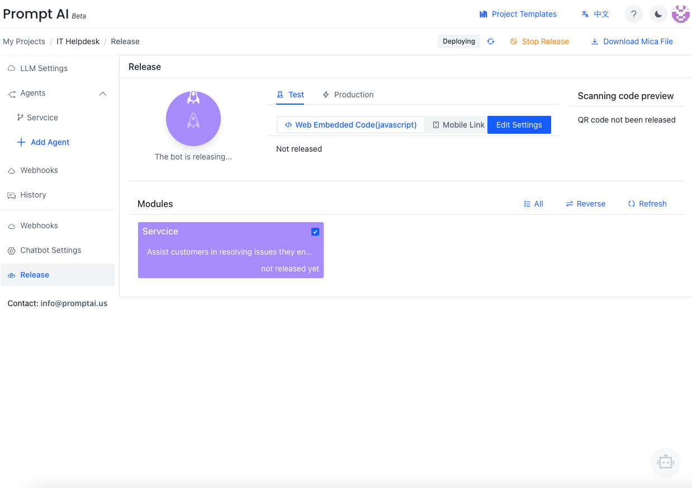
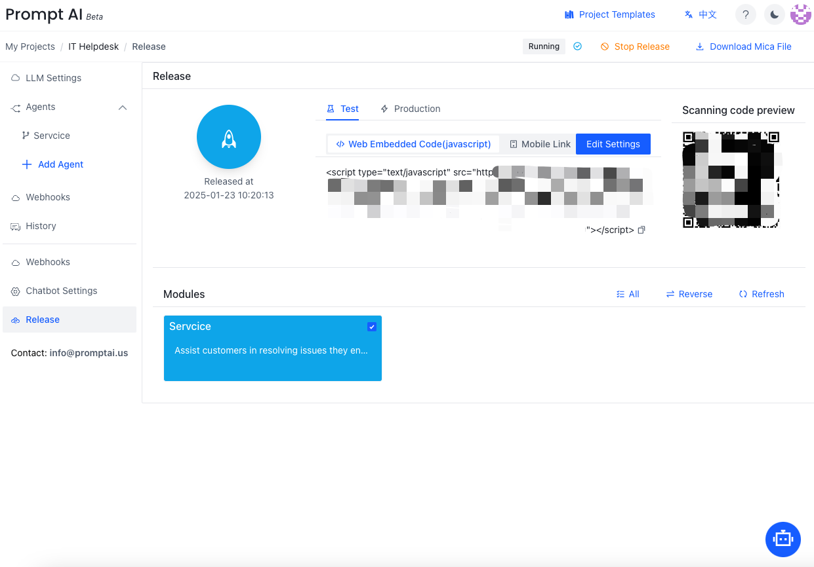
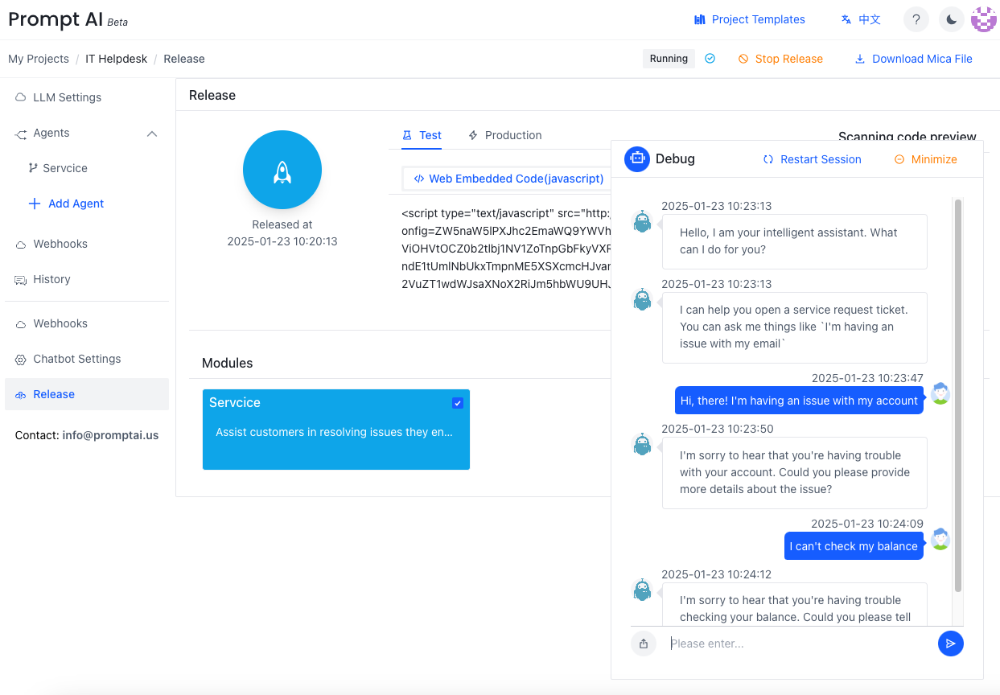
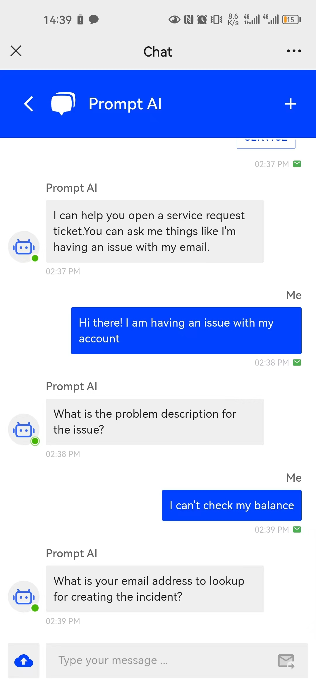
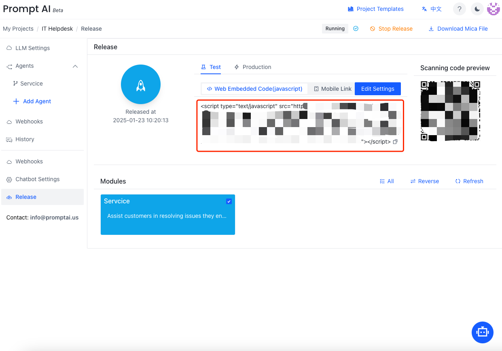
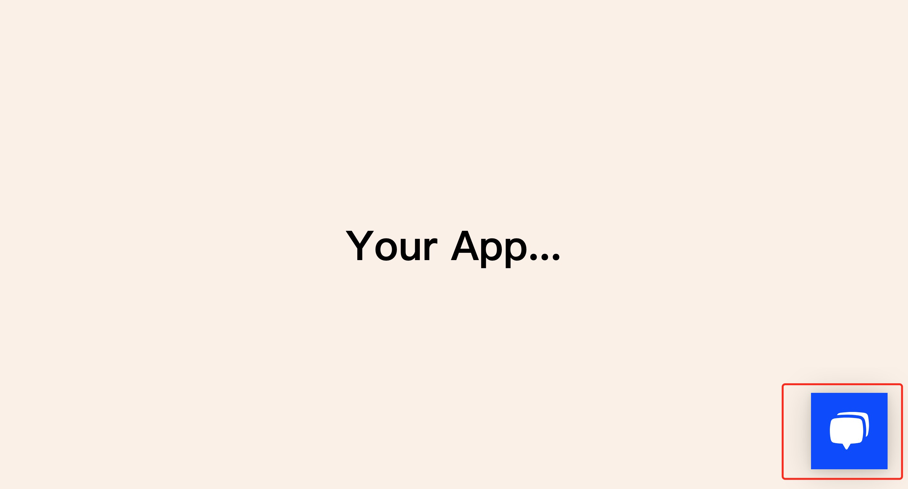

## Select modules to release
Click the project tool on the left navigation pane, click `Release`, select which modules to release, and then push the button `Click to release`.
If there is an **update after publishing**, you need to `Click to release` again to make the update take effect.



## Release
As shown in the figure, an icon will display the task status and the text of the release button will change to being released. At this time, users can work on other tasks or click `Stop release` on the right corner to stop releasing.



## Release complete

As shown in the figure, after the releasing is completed.



## Test
As shown in the figure, type the chat information in the dialog window to verify whether the bot replies as expected.



## Release in your app or website
The bot can be deployed through QR code or embedded in a web page.

Requirement:
- Internet support
- Allow access: https://app.promptai.us  at port: 443
- Modern browsers: like latest version of Chrome

###  QR code [Mobile]
When you need to access the mobile terminal, you can experience it by accessing the mobile terminal link or scanning the QR code.


* Embed the QR code into the website, and users can experience the published projects through mobile browser scanning or WeChat scanning


### Web page
1. As shown, here we have prepared a project and released it in the project


    - Paste the "Web Embedded Code(javascript)" in your html header
    ```html
        '<!DOCTYPE html>
        <html lang="en">
        <head>
          <meta charset="UTF-8">
          <meta http-equiv="X-UA-Compatible" content="IE=edge">
          <meta name="viewport" content="width=device-width, initial-scale=1.0">
          <title>Document</title>
          <style>
            * {
              margin: 0;
              padding: 0;
              box-sizing: border-box;
            }
            body {
              background-color: linen;
            }
            main {
              display: flex;
              justify-content: center;
              align-items: center;
              height: 100vh;
            }
          </style>
        </head>
        <body>
          <main>
            <h1>Your App...</h1>
          </main>
          {Your script is here.}      
        </body>
        </html>  '  
    ```

2. When you open the website, there will be a chatbox on the lower right corner of the website. Click it to start a chat session.
