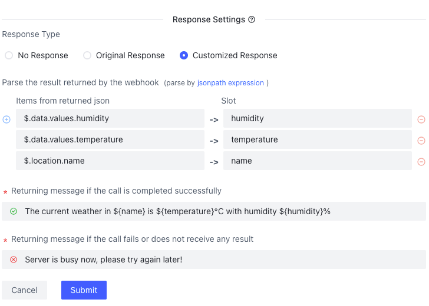
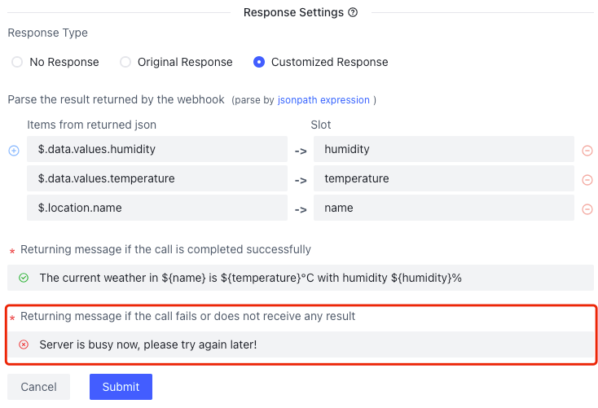

Here is an example of querying weather for your reference.
```text
User: Hi, can you please tell me the weather in New York?
Bot: Sure! Let me check the current weather conditions for you. Just a moment, please.
# It needs to trigger a webhook that communicates with a third party weather server to query the weather in "New york."

# Once the query result recieved, it can be packaged in a response and sent to the user.
Bot: The current weather in New York is 82°F (28°C) with mostly sunny conditions. The wind is blowing at a speed of 5 mph (8 km/h), and the humidity is around 60%. Is there anything else you would like to know?
User: Thank you for the forecast! That's helpful.
```
---
There are two steps to call a webhook. 

### Step 1.
Click `Project View` - `Webhooks`. Click `+ Add` on the upper right corner.  Create a webhook to call the weather API (more details later). 




### Step 2. 
Create a flow for querying weather and select a webhook in a bot reply node. 


The following is the detailed setting instruction for Step 1.
### Basic Settings
- name : The name to refer the new webhook.
- URL : The url here has the same meaning as http url. Please pay attention to the 'http/https' protocol when filling in here. It is the access link that the third party service provides to you.  In addition, the URL address also supports the transmission of variable value. When calling the webhook, the corresponding variable placeholder will be replaced with its corresponding value.  As shown in the figure, if we define a slot `city` in the flow diagram, we can use `{city}` to send the value to the third party service provider. 
   ```
   api.tomorrow.io/v4/weather/realtime?location={city}&apikey=your_key
   ```
  
### Request Settings
- Request Method: Represents the http request method, which upports the following. 
   * get
   * post
   * put
   * delete

- Request Header: Represents the http request header, which can be added here when the external interface needs a specific request header.
   * No header     : nothing
   * Custom header : key-value pairs

- Request Body: Supports four formats. 

| Type | Content-Type                      | Format            | Comment                      |
|------|-----------------------------------|-------------------|:-----------------------------|
| None | -                                 | -                 | -                            |
| Form | application/x-www-form-urlencoded | key - value pairs | File not support             |
| JSON | application/json                  | json string       |                              |
| Text | text/plain                        | text string       |                              |


 * Notice: Same as URL, we also support the use of slot value in the request body, e.g., '{city}'.

### Response Settings
These settings handle the result received from the third party API call and package it as a response to the user.  If the result does arrive, we could take one of the following actions. 

| Name                    |  processing                                                          | Response Data Requirement |
|-------------------------|----------------------------------------------------------------------|---------------------------|
| No Response             | Ignore the returned result and output nothing                        | -                         |
| Original Response       | Display the returned results directly                                | -                         |
| Customized Response     | Extract fields from the result through JsonPath, and package them in a customized response   | json         |

Due to many factors, sometimes the API call fails.  We need to send a hint to the user when the webhook request fails. Note that this situation is different from an empty result returned by the API call.  Set a short message at `Returning message if the call fails or does not receive any result`.



Take the weather query as an example.  Suppose there is a weather service that responds with:
```json
{
  "temperature": "82°F (28°C)",
  "conditions": "Mostly sunny",
  "wind": "5 mph (8 km/h)",
  "humidity": "60%"
}
```
There are four types of responses we can generate: 
```text
// - Ignore the status code  【Bot will reply what you set】
//  for some reason, the weather service does not respond, we set text:
// "The service is unavailable, please try again later" at `Returning message if the call is completed successfully`
User: Hi, can you please tell me the weather in New York?
Bot : The service is unavailable, please try again later

// - Ignore Bot will not reply any message】
User: Hi, can you please tell me the weather in New York?

//  - Original response 【Bot will reply whatever the api return】
User: Hi, can you please tell me the weather in New York?
Bot : {"temperature":"82°F (28°C)","conditions":"Mostly sunny","wind":"5 mph (8 km/h)","humidity":"60%"}

// - User customized response 【Bot will reply what you set with value extracted from the response】
// For example, we can set text:
// Sure! I can provide you with the weather information for New York. Here is the current weather forecast for New York: temperature:{temperature} 、wind:{wind} 、conditions: {conditions} and humidity: {humidity}
// at `Returning message if the call is completed successfully`

User: Hi, can you please tell me the weather in New York?
Bot : Sure! Let me check the current weather conditions for you. Just a moment, please.
     The current weather in New York is  6.5°C  with  humidity 48%
```

### Extract value from API response
The above process needs a step to extract values from the API call and fill them in slots.  Suppose we have the following result sent by the weather service API. 

```json
{
  "temperature": "82°F (28°C)",
  "conditions": "Mostly sunny",
  "wind": "5 mph (8 km/h)",
  "humidity": "60%",
  "city": "New York"
}
```
We shall do the following JsonPath reference and map the value to the slots. 


<!---
1、Choose 'Custom Display'


Chat
```text
User: Hi, can you please tell me the weather in New York?
Bot : The current temperature in New York is 82°F (28°C)
```
--->

---

## Common Issues
Q1: When referring a slot in the API call, what happens if the slot doesn't exist or if the slot is misspelled?
   
Take the following URL as an example：`http://localhost/api?area={area}&date={date}`
- If area=New York, when successfully called, the actual requested url::
  `http://localhost/api?area=New York`
- If the slot does not exist or is misspelled, it will not be called correctly, the actual requested url might be:  `http://localhost/api?area={area}&date={date}`

Q2: Can variables extracted in "Response Settings" have the same name as slots existing in the dialog flows?

  Their name can be the same.  The slots will be filled with the extracted value. 

Q3: How does the extracted slot value change when the same webhook is called multiple times?
   
The extracted slot will be the value extracted after the last call to the webhook, that is, the value of the slot can change.

Q4: Can the slots generated by the webhook value extraction be used in other parts of the flow design?

If you want to use these slots, please define them in the project in advance.

More examples [click here](/docs/webhook/02-webhook/).
